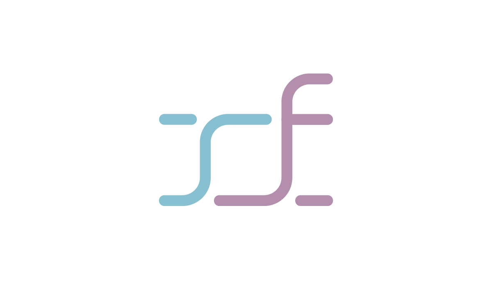
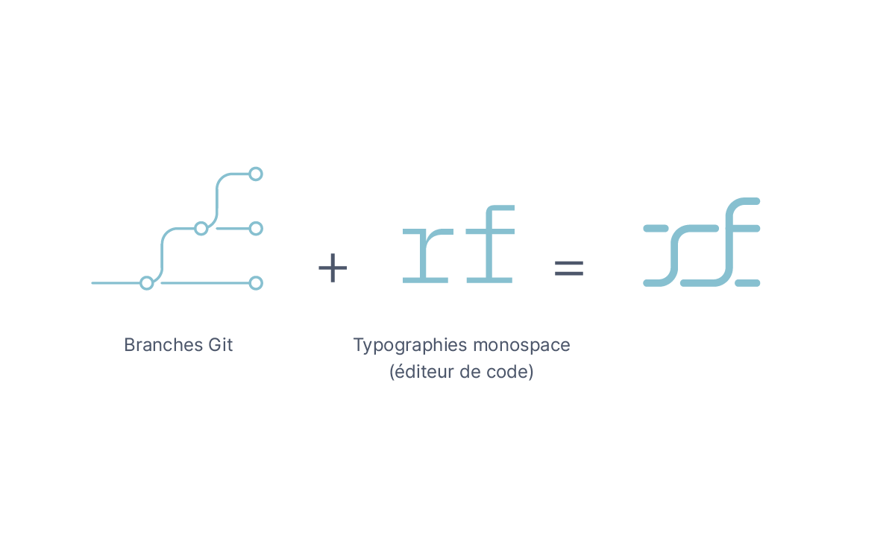
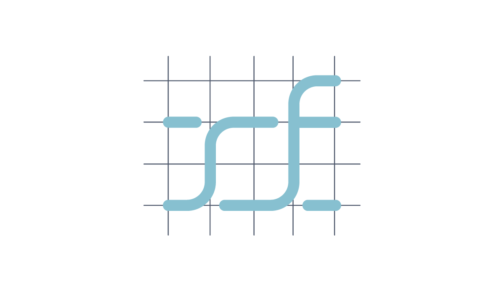
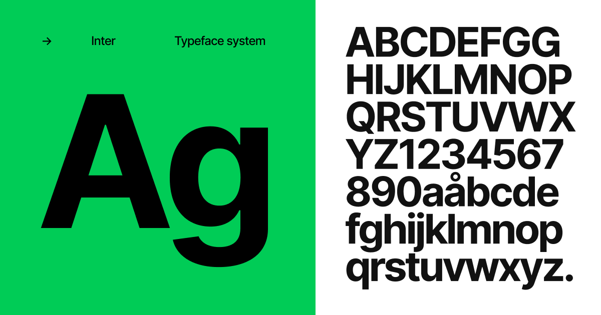
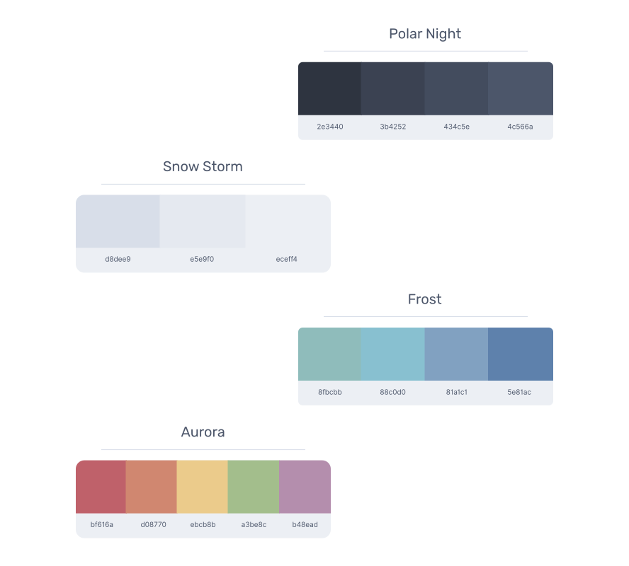
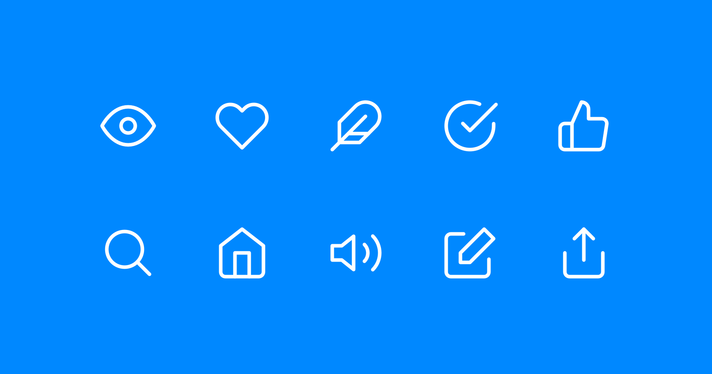

C'est le grand jour ! Je suis fier de dévoiler aujourd'hui un site web fraichement remodelé et une nouvelle identité visuelle. Entre le travail, la famille et la vie en général, je n'avais pas trouvé le temps de mettre à jour mon site depuis 2017. Par ailleurs, mon profil ayant fortement évolué depuis cette époque, il était largement  temps de reprendre tout cela en main afin que ces nouveaux outils reflètent ce changement !

## Le site

### Un site réalisé avec Gatsby

Vous allez beaucoup m'entendre parler de [Gatbsy](https://www.gatsbyjs.org/) et des générateurs de sites statiques en général. Mais quelle est cette nouvelle technologie ? Pour résumer, le SSG (*static site generator*) combine une source de données, des templates et des composants pour générer des sites statiques directement servis aux visiteurs. Un site statique, certes, mais géré dynamiquement ! Les bénéfices sont multiples :

* Des **niveaux de performance inégalables** par des sites dynamiques traditionnels (WordPress par exemple).
* Des **économies** de gestion et d'hébergement.
* Des sites web **fiables**, présentant **moins de failles de sécurité**.
* Des utilisateurs et des développeurs contents 😃

Si vous voulez en savoir plus, un nouvel article à ce sujet est dans les tuyaux et sera publié très bientôt ! 

### Et le contenu ?

Le contenu du site, c'est-à-dire les textes, articles et médias, est manipulé avec [NetlifyCMS](https://www.netlifycms.org/), un CMS *open source* adapté aux sites statiques, **simple de prise en main** et assez **configurable**. Il a été créé par la plateforme de déploiement [Netlify](https://www.netlify.com/) que j'utilise moi-même pour mes projets. L’intégration du CMS avec la plateforme est optimale et donne beaucoup de possibilités. 

### Sous le capot

* **[Styled Components](https://styled-components.com/)** | librairie CSS-in-JS pour la stylisation des composants React.
* **[Typefaces](https://github.com/KyleAMathews/typefaces)** | Outil facilitant le téléchargement de webfonts via NPM.
* **[Lodash](https://lodash.com/)** | L'indispensable librairie utilitaire en JavaScript.
* **[Formik](https://formik.org/)** | Une librairie qui facilite la création et la gestion des formulaires dans React. 
* **[PrismJs](https://prismjs.com/)** | Outil de coloration de code pour les articles techniques.

## L'identité

Pour le logo, l'enjeu principal était d'obtenir une image qui fasse le lien  entre mon profil de designer et mes compétences de développeur front end. Un monogramme élaboré à partir d'initiales m'a semblé être une piste à la fois simple et porteuse puisqu'elle traduit mon amour pour la lettre ! 

J'ai également tiré inspiration des représentations graphiques de branches dans le logiciel de versionnage [Git](https://git-scm.com/) (un outil essentiel pour les développeurs). En croisant ces éléments de technologie et de typographie, j'ai pu obtenir un résultat pertinent, élégant, définitivement ancré dans le design et les nouvelles technologies.

## La typographie

Pour la typographie, mon choix s'est porté sur la police [Inter](https://rsms.me/inter/) créée par **Rasmus Andersson**, un développeur logiciel basé à San Francisco, passionné de design et typographie. Voici les aspects qui m'ont séduit dans cette police :

* Elle est ***open source* et gratuite**.
* Elle présente **une hauteur d'x importante**, ce qui assure un certain confort de lecture même en petit corps de texte ou dans d'autres conditions difficiles.
* Elle a été spécialement **conçue pour un usage écran**.
* Appartenant à la grande famille des *grotesque*, son design est à la fois **universel et contemporain**.

### La palette de couleurs

La palette de couleurs utilisée par le site et l'identité visuelle s'appuie largement sur le thème [Nord](https://www.nordtheme.com/) très connu de nombreux développeurs car il est souvent utilisé pour la colorisation du code dans certains éditeurs de texte. J'ai choisi cette palette pour sa **sobriété** et sa **simplicité**. Son niveau de contraste global est bon sans être trop fort, ce qui a un effet assez apaisant pour les interfaces utilisateurs où il est en usage. 

## Les icônes

Pour les icônes présents dans l'interface du site, j'ai opté pour la bibliothèque d'icône [Feather](https://feathericons.com/) que j'ai l'habitude d'utiliser. Les **terminaisons arrondies** ainsi que le dessin **sobre et minimaliste** étant en parfaite adéquation avec le logo réalisé en amont, ce choix me semblait évident. De plus, [un paquet NPM](https://github.com/feathericons/react-feather) très pratique propose une collection de composants React correspondant à chaque icône. 

## Conclusion

Le site et l'identité sont des objets vivants qui vont continuer d'évoluer mais les bases sont là et après plusieurs semaines de travail, je peux dire que j'en suis plutôt satisfait. J’espère que tout cela vous a plu et que votre curiosité est satisfaite. N'hésitez pas à me faire signe si vous avez des questions ou de demandes à ce sujet, je serai très heureux de partager un peu plus de mon expérience !